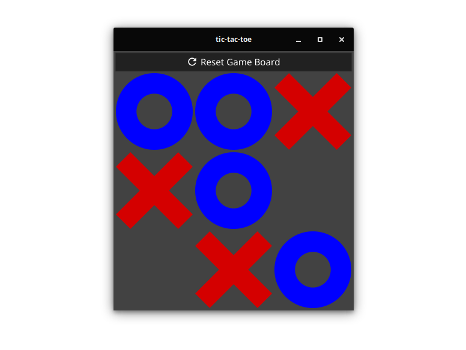

# fyne-board-games

This repository holds a set of board games developed using the Fyne toolkit.

## tic-tac-toe

A simple local two player game of tic-tac-toe. It was originally built as part of a school project, but this version has been rewritten from scratch.

  

